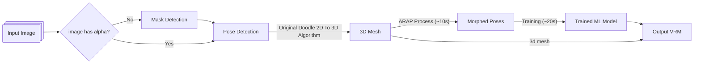

## ARAP Flow

```mermaid
flowchart LR

a@{ shape: procs, label: "Input Image" }
b[Mask Detection]
c[Pose Detection]
d[3D Mesh]
f[Morphed Poses]
g[Trained ML Model]
h[Output VRM]

a --> a1{image has alpha?}
a1 -- No --> b
b --> c
a1 -- Yes --> c
c -- Original Doodle 2D To 3D Algorithm --> d
d -- ARAP Process (~10s) --> f
f -- Training (~20s) --> g
g --> h
d -- 3d mesh --> h
```

## New Flow

```mermaid
flowchart LR

a@{ shape: procs, label: "Input Image" }
b[Mask Detection]
c[Pose Detection]
d[3D Mesh]
f["Big Model (Should takes less than 1 second)"]
g[Predicted ML Model]
h[Output VRM]

a --> a1{image has alpha?}
a1 -- No --> b
b --> c
a1 -- Yes --> c
c -- Original Doodle 2D To 3D Algorithm --> d
d --> f
subgraph New Flow
    f --> g
end
g --> h
d -- 3d mesh --> h

```