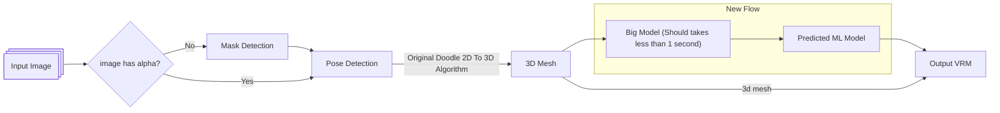

# 2D Avatar Training

ARAP flow took too much time to generate single image.

New flow is trying to replace arap & training into single big model.

Note: This is not finished


## ARAP Flow


## New Flow



## Training Data Example:

Download: [2d-avatar-training-data.zip](https://drive.google.com/file/d/1S6NVPIViUWXV6x8AokL--Dw1t4XGsCDt/view?usp=sharing) unzip to /path/to/training_data/


## Requirement
1. pytorch
2. matplotlib
3. tensorboard
4. scipy
5. pytorch3d (optional you can run without this but you need this anyway)
6. pyrender (optional for debug render, I find this one is really hard to setup in docker image)
7. avatar2d branch: arap_training_data  (optional for make_training_data, also you need assets/ & checkpoints/ from avatar2d)

## Training

```bash
python train.py /path/to/training_data/ /path/to/checkpoint/
```


